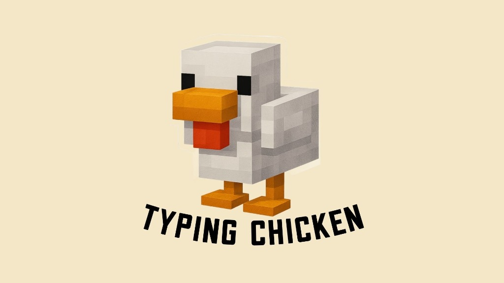

# 🐔 Typing Chicken - English Vocabulary Typing Game

<p align="center">
  
</p>

<p align="center">
  <strong>A fast-paced, interactive English typing game with 3 distinct game modes, real-time WPM calculation, accuracy tracking, and mobile keyboard-aware optimization.</strong>
</p>

<p align="center">
  <a href="https://waranyu1150.github.io/GameTyping/">
    
  </a>
  
  
  
</p>

---

## 🌟 Game Modes

### 1. 🐔 Classic Mode (Typing Chicken)
* **30 Challenging Levels**: Progressively escalates from simple 3-letter words to advanced multi-syllable vocabulary.
* **Star Rating System (1–3 Stars)**: Evaluated based on first-try typing accuracy ($\ge 60\%$, $\ge 80\%$) and completion time ($\le 48\text{s}$).
* **Word Skip Helper**: 1 emergency skip available per level.
* **Progression System**: Unlock next levels as you master each stage.

### 2. ⛏️ Minecraft Edition
* **20 Themed Levels**: Curated iconic vocabulary from the authentic Minecraft universe (blocks, ores, items, mobs, and tools).
* **Isolated Progression**: Independent save slots and star ratings separate from Classic mode.
* **Themed Visuals**: Custom emerald accent theme and custom artwork.

### 3. ♾️ Endless Survival Mode
* **Continuous Random Vocabulary**: Dynamic pool of **600+ diverse words** across everyday categories, nature, science, objects, and verbs.
* **Survival Time Mechanic**: Start with 60.0s. Each correct word awards **+2.0s bonus time** (capped at 60.0s).
* **High Score Tracking**: Tracks your best survival record (words survived, top WPM, max combo streak, and accuracy).

---

## ⚡ Core Features & Mechanics

* **Smart Keystroke Timer**: The 60-second countdown does not tick down on entry; it activates on your very first keystroke, giving players time to prepare.
* **Live WPM & Accuracy Metrics**: Standardized international typing calculation updated in real time.
* **Streak Combo Counter**: Rewards consecutive first-try correct words; resets on spelling errors to incentivize precision.
* **Synthesized Web Audio Engine**: Clean, latency-free sound effects (key clicks, chimes, buzzers) generated on-the-fly via Web Audio API without external audio asset downloads.
* **Mobile & Virtual Keyboard Optimization**: Ultra-compact layout under 350px tall to fit cleanly above mobile on-screen keyboards without scrolling.
* **Dark & Light Mode**: Seamless theme switcher with high-contrast color palettes.
* **Leave Level Confirmation**: Auto-pauses gameplay and confirms before discarding active progress.
* **100% Client-Side & Private**: Runs entirely in the browser with zero external tracking or data collection.

---

## 🛠️ Technology Stack

* **Frontend**: Vanilla JavaScript (ES6+ Modules), HTML5, CSS3 Custom Properties
* **Audio**: Web Audio API (Synthesizer)
* **Storage**: LocalStorage API
* **Installability**: Progressive Web App (PWA) with `manifest.json`

---

## 🚀 How to Run Locally

1. Clone or download this repository:
   ```bash
   git clone https://github.com/Waranyu1150/GameTyping.git
   cd GameTyping
   ```
2. Start any local HTTP server:
   ```bash
   # Using Python 3:
   python -m http.server 8080
   ```
3. Open your browser and navigate to:
   ```
   http://localhost:8080/
   ```

---

## 📄 Disclaimer
*Minecraft is a trademark of Mojang Synergies AB. This project is an unofficial fan-made educational game and is not affiliated with or endorsed by Mojang or Microsoft.*
